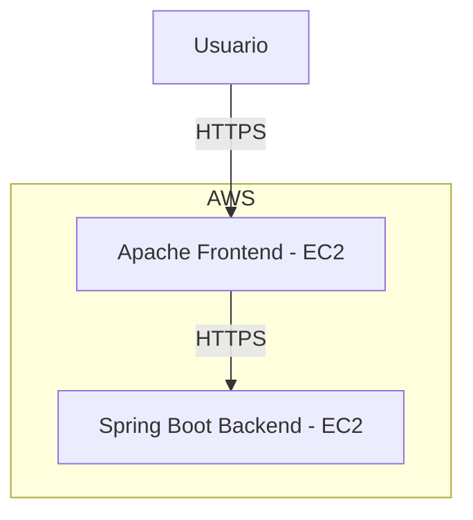

# 🔒 Enterprise Architecture Workshop: Secure Application Design

## 📌 Descripción del Proyecto
Este proyecto consiste en una aplicación web segura con frontend en **Apache (EC2 1)** y backend en **Spring Boot (EC2 2)**, ambos protegidos con **HTTPS**.

Se implementó una arquitectura en AWS con certificados SSL autofirmados para garantizar la seguridad en las comunicaciones entre frontend y backend.

---

## 🏗 **Arquitectura del Proyecto**




## 🚀 **Pasos de Implementación**

### 🔹 **1. Configurar el Servidor Apache en EC2 (Frontend)**
#### 📌 **Instalar Apache y habilitar SSL**
```sh
sudo yum update -y
sudo yum install -y httpd mod_ssl openssl
```

#### 📌 **Generar un Certificado Autofirmado**
```sh
sudo openssl req -x509 -nodes -days 365 -newkey rsa:2048 \
    -keyout /etc/ssl/private/apache-selfsigned.key \
    -out /etc/ssl/certs/apache-selfsigned.crt
```

#### 📌 **Configurar Apache para HTTPS**
```sh
sudo nano /etc/httpd/conf.d/ssl.conf
```
🔹 Modificar las líneas:
```apache
SSLCertificateFile /etc/ssl/certs/apache-selfsigned.crt
SSLCertificateKeyFile /etc/ssl/private/apache-selfsigned.key
```

#### 📌 **Reiniciar Apache**
```sh
sudo systemctl restart httpd
```

---

### 🔹 **2. Configurar el Backend en EC2 (Spring Boot)**
#### 📌 **Generar el Certificado para el Backend**
```sh
sudo openssl req -x509 -nodes -days 365 -newkey rsa:2048 \
    -keyout backend-key.pem \
    -out backend-cert.pem \
    -subj "/C=US/ST=State/L=City/O=Company/OU=Org/CN=<BACKEND_EC2_PUBLIC_IP>"
```

#### 📌 **Convertirlo a PKCS12 (`keystore.p12`)**
```sh
sudo openssl pkcs12 -export -in backend-cert.pem -inkey backend-key.pem \
    -out keystore.p12 -name backend-cert -passout pass:123456
```

#### 📌 **Configurar Spring Boot (`application.properties`)**
```properties
server.port=5000
server.ssl.key-store=file:/home/ec2-user/keystore.p12
server.ssl.key-store-type=PKCS12
server.ssl.key-store-password=123456
server.ssl.key-alias=backend-cert
server.ssl.enabled=true
```

#### 📌 **Ejecutar el Backend**
```sh
java -jar lab07-1.0-SNAPSHOT.jar &
```

---

### 🔹 **3. Configurar el Frontend para Conectarse al Backend**
#### 📌 **Importar el Certificado del Backend en el TrustStore**
```sh
keytool -importcert -file backend-cert.pem -keystore myTrustStore.p12 -storetype PKCS12 -storepass 123456 -alias backend-cert
```

#### 📌 **Modificar `index.js` para Usar HTTPS**
```js
const backendUrl = "https://<BACKEND_EC2_PUBLIC_IP>:5000";
```

#### 📌 **Reiniciar Apache para Aplicar Cambios**
```sh
sudo systemctl restart httpd
```

---

## ✅ **Pruebas Finales**
1️⃣ **Abrir el navegador y probar el frontend:**
```
https://<FRONTEND_EC2_PUBLIC_IP>/
```
2️⃣ **Hacer login y verificar que la respuesta del backend es correcta.**

✔ **Debe devolver `"Login successful!"`.**


https://github.com/user-attachments/assets/9093eb0e-512d-4273-a1f1-f6d3fe748bcc


## 📌 **Conclusión**
✔ Se implementó una aplicación segura con **HTTPS en frontend y backend**.  
✔ Se usaron certificados SSL autofirmados y un TrustStore para evitar errores de seguridad.  
✔ Se configuraron **EC2 separadas** para el frontend y el backend en AWS.  

📌 **Si tuviéramos un dominio, podríamos usar Let's Encrypt para obtener un certificado SSL válido.**  


🚀 **Autoría de Tomas Suarez** 🔥

